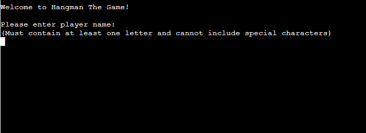
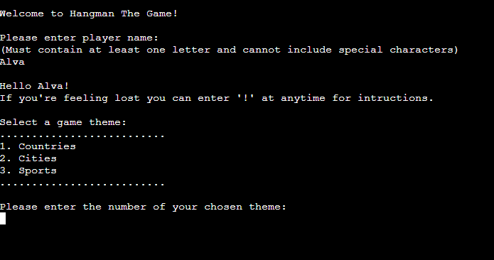
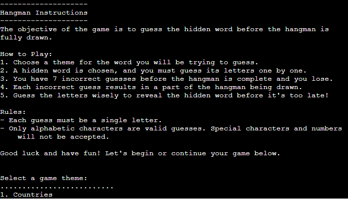
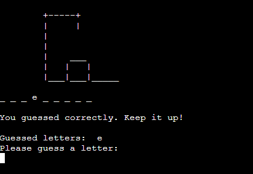
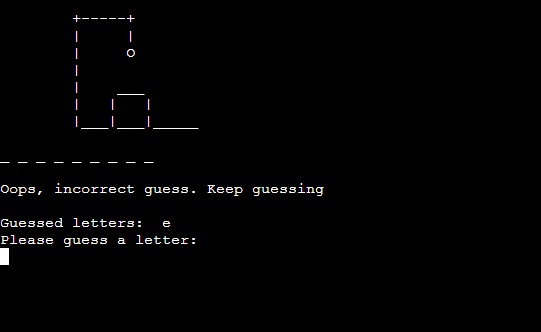
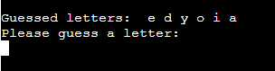
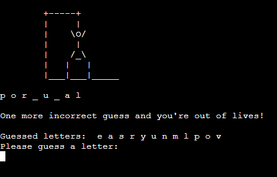
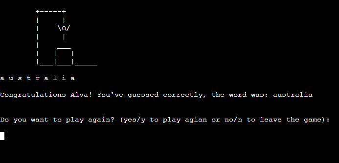
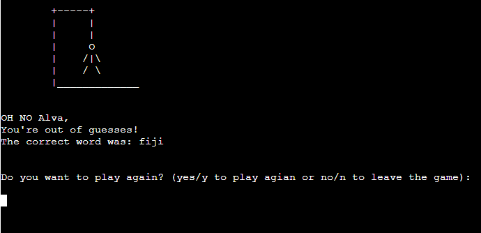
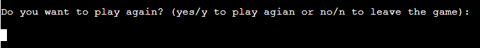

# Hangman The Game

*The link to [Hangman The Game](https://hangman-the-game-43fde6f5e4b3.herokuapp.com/)*

Explore Words with Customizable Hangman Themes - Hangman The Game is a python terminal game based on the classic hangman game you used to play when you were younger! Join the excitement, where exploration meets entertainment! With themes like cities, countries, and sports, you'll enjoy:

* Engaging Learning: Enhance vocabulary and knowledge about the world.
* Personalized Challenge: Choose your favorite theme for a tailored experience.
* Social Fun: Challenge friends and family, sparking conversations and bonding.
* Mental Stimulation: Exercise strategic thinking and pattern recognition.
* Endless Entertainment: With diverse themes, boredom is never an option.

Start playing now and let the word adventures begin!

    ---

## How to play
1. Click this link *[link](https://hangman-the-game-43fde6f5e4b3.herokuapp.com/) or copy this link https://hangman-the-game-43fde6f5e4b3.herokuapp.com/ and paste it in your browsers search bar.
1. When the page has loaded, click 'RUN PROGRAM'.
1. Enter your name to start playing.
1. Begin by selecting a theme, which will determine the category of the word you'll be attempting to decipher.
1. A hidden word from the theme you've picked will appear with underscores for every letter so you can see the length of the word.
1. Guess letters one by one to uncover the hidden word.
1. Beware, you have only seven incorrect guesses before losing and each wrong guess adds a part to the hangman's drawing.
1. You win by deciphering the word before the hangman is fully drawn.
1. At the end of the game you get the option to play again. By entering 'yes', you will be asked to pick a theme and go again. By entering 'no' the terminal will be cleared and you will exit the game.

Link to game: *https://hangman-the-game-43fde6f5e4b3.herokuapp.com/*

    ---

## User Stories 
### First Time Visitor Goals:

* As a first time visitor, I want to easly understand the concept including how to select themes, guess letters, and avoid completing the hangman drawing.
* As a first time visitor, I want to easly navigate through the program.
* As a first time visitor, I want to get informative error messages if I get stuck so I know how to proceed.

### Frequent Visitor Goals:
* As a Frequent User, I want to be provided with a diverse selection of words within each theme to ensure that the game remains engaging and consistently challenging.
* 

## Features
 **When the program is loaded**

When the program starts a welcome message will appear to welcome the user and introduce the name of the game.
Under the welcome message the user is kindly asked to enter their player name. Some added details regarding the input requirements are also displayed to clearly inform the user of what they cannot include in their player name. 

 

 After the user has entered their player name a message will appear greeting the player with their player name and informs player how to access the instructions to the game.

 **Under the greeting and information about how to access the instructions the player is asked to pick a theme of the game by entering '1' for countries, '2' for cities or '3' for sports.**

 

If the user enters a letter, special character, or a number greater than 3, or leaves the input empty, an error message will appear. This message explains that the input is incorrect and provides guidance on the available options.

**If the user inputs '!' to request instructions** 

When entering '!' a description of how you play the game will be displayed in the terminal. Additionally, the game themes will be listed below, allowing the player to easily return to the game after reading the instructions. The player can access the instructions at any point during the game by entering '!'.

**When the user has picked the theme of the game**

The chosen theme is represented at the top of the screen followed by an enthusiastic message saying 'Let's play Hangman!' to build excitement for the upcoming challenge.

The player can then see the initial part of the hangman picture and a series of underscores representing the letters of the secret word they need to guess.

**Guessing letters**

* When correct guess:

When guessing a letter that is included in the hidden word a message saying 'You guessed correctly' appears and the letter shows up in the hidden word. 

* When incorrect guess: 

If the guessed letter is incorrect, a message appears notifying the player that the letter was not found in the hidden word. Additionally, since the guess was incorrect, the hangman picture begins to take shape, starting with the addition of the head.

* Guessed letters

The guessed letters are displayed above the input field, allowing the player to keep track of their guesses and avoid repeating any letters. 

* If the player has only one remaining chance before running out of lives.

When the player has only one incorrect guess left before losing the game, a message appears to alert them. This serves as a reminder for the player to be extra careful with their guesses.

**Winning** 

When successfully guessing all the letters in the hidden word, you win the game. The hidden word is then revealed on the screen along with a congratulatory message.

**Losing**

If the player fails to guess all the correct letters in the hidden word before the hangman is fully drawn, they lose the game. In the event of a loss, the completed hangman picture is displayed, and the hidden word is revealed.

**Play again**

After the game ends, the player is prompted to either play again or exit. If they choose to play again, they get to restart the game by selecting a theme for the new round.

**Error messages** 

* When the user's input is invalid, an error message is displayed, providing clear guidance on the issue and what action is needed to proceed and continue the game.

* If the user chooses to exit the game midway, an error message reading 'Game interrupted. Exiting...' will be displayed, followed by clearing the terminal for a seamless transition.

