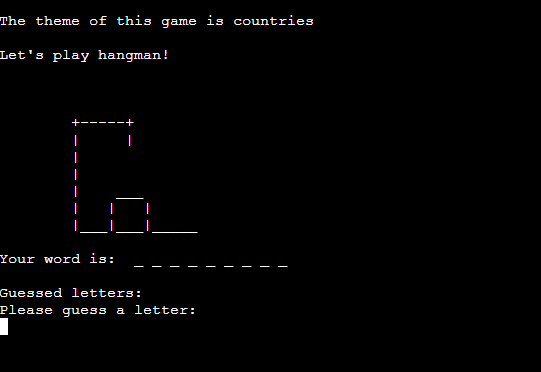
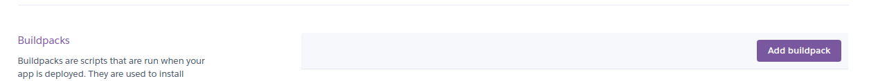

# Hangman The Game


*The link to [Hangman The Game](https://hangman-the-game-43fde6f5e4b3.herokuapp.com/)*

Explore Words with Customizable Hangman Themes - Hangman The Game is a python terminal game based on the classic hangman game you used to play when you were younger! Join the excitement, where exploration meets entertainment! With themes like cities, countries, and sports, you'll enjoy:

* Engaging Learning: Enhance vocabulary and knowledge about the world.
* Personalized Challenge: Choose your favorite theme for a tailored experience.
* Social Fun: Challenge friends and family, sparking conversations and bonding.
* Mental Stimulation: Exercise strategic thinking and pattern recognition.
* Endless Entertainment: With diverse themes, boredom is never an option.

Start playing now and let the word adventures begin!


## How to play
1. Click this [link](https://hangman-the-game-43fde6f5e4b3.herokuapp.com/) or copy this url https://hangman-the-game-43fde6f5e4b3.herokuapp.com/ and paste it in your browsers search bar.
1. When the page has loaded, click 'RUN PROGRAM'.
1. Enter your name to start playing.
1. Begin by selecting a theme, which will determine the category of the word you'll be attempting to decipher.
1. A hidden word from the theme you've picked will appear with underscores for every letter so you can see the length of the word.
1. Guess letters one by one to uncover the hidden word.
1. Beware, you have only seven incorrect guesses before losing and each wrong guess adds a part to the hangman's drawing.
1. You win by deciphering the word before the hangman is fully drawn.
1. At the end of the game you get the option to play again. By entering 'yes', you will be asked to pick a theme and go again. By entering 'no' the terminal will be cleared and you will exit the game.

Link to game: *https://hangman-the-game-43fde6f5e4b3.herokuapp.com/*


## User Stories 
### First Time Visitor Goals:

* As a first time visitor, I want to easly understand the concept including how to select themes, guess letters, and track my progress.
* As a first time visitor, I want to easly navigate through the program.
* As a first time visitor, I want to get informative error messages if I get stuck so I know how to proceed.

### Frequent Visitor Goals:
* As a frequent user, I want to be provided with a diverse selection of words within each theme to ensure that the game remains engaging and consistently challenging.
* As a frequent user, I want a smooth and effortless user experience from start to finish to maximise fun. 

## Features
 **When the program is loaded**

When the program starts a welcome message will appear to welcome the user and introduce the name of the game.
Under the welcome message the user is kindly asked to enter their player name. Some added details regarding the input requirements are also displayed to clearly inform the user of what they cannot include in their player name. 


 After the user has entered their player name a message will appear greeting the player and informing them on how to access the instructions to the game.

**Select game theme**

Under the greeting and information about how to access the instructions the player is asked to pick a theme of the game by entering '1' for countries, '2' for cities or '3' for sports.


If the user enters a letter, special character, or a number greater than 3, or leaves the input empty, an error message will appear. This message explains that the input is incorrect and provides guidance on the available options.

**If the user inputs '!' to request instructions** 

When entering '!' a description of how you play the game will be displayed in the terminal. Additionally, the game themes will be listed below or their current game continued, allowing the player to easily return to the game after reading the instructions. The player can access the instructions at any point during the game by entering '!'.


**When the user has picked the theme of the game**



The chosen theme is represented at the top of the screen followed by an enthusiastic message saying 'Let's play Hangman!' to build excitement for the upcoming challenge.

The player can then see the initial part of the hangman picture and a series of underscores representing the letters of the secret word they need to guess.

**Guessing letters**

* When correct guess:


When guessing a letter that is included in the hidden word a message saying 'You guessed correctly' appears and the letter shows up in the hidden word. 

* When incorrect guess: 


If the guessed letter is incorrect, a message appears notifying the player that the letter was not found in the hidden word. Additionally, since the guess was incorrect, the hangman picture begins to take shape, starting with the addition of the head.

* Guessed letters


The guessed letters are displayed above the input field, allowing the player to keep track of their guesses and avoid repeating any letters. 

* If the player has only one remaining chance before running out of lives.


When the player has only one incorrect guess left before losing the game, a message appears to alert them. This serves as a reminder for the player to be extra careful with their guesses.

**Winning** 


When successfully guessing all the letters in the hidden word, you win the game. The hidden word is then revealed on the screen along with a congratulatory message.

**Losing**


If the player fails to guess all the correct letters in the hidden word before the hangman is fully drawn, they lose the game. In the event of a loss, the completed hangman picture is displayed, and the hidden word is revealed.

**Play again**

After the game ends, the player is prompted to either play again or exit. If they choose to play again, they get to restart the game by selecting a theme for the new round.


If the player wants to exit the game they can enter no and the terminal will be cleared and a goodbye message appear.


**Incorrect user input messages and validation** 

* The user cannot input a empty respons/guess

* The user cannot input a number. Except when prompted for theme choices where numbers 1, 2, and 3 are considered valid.

* The user cannot input special characters, except for '!' for instructions.

* The user can only input one character.

* The user cannot guess the same letter twice.

* When the user's input is invalid, an error message is displayed, providing clear guidance on the issue and what action is needed to proceed and continue the game.

* If the user chooses to exit the game midway, an error message reading 'Game interrupted. Exiting...' will be displayed, followed by clearing the terminal for a seamless transition.

## Flowchart

The flowchart below presents my initial concept for the Hangman game. Using this flowchart the hangman game play utility was constructed. From this inital concept the game was further developed to provide a smoother and more exciting user experience. 


## Technologies Used

### Languages:

* [Python 3.12.1](https://www.python.org/downloads/release/python-3121/) established the framework for the project and guiding all aspects of application behavior.
* [JavaScript](https://www.javascript.com/): used to provide the start script needed to run the Code Institute mock terminal in the browser.
* [HTML](https://developer.mozilla.org/en-US/docs/Web/HTML) utilized in constructing the components necessary for building the mock terminal within the browser.

### Frameworks/Libraries, Programmes and Tools:
#### Python modules/packages:

##### Standard library imports:
* [random](https://docs.python.org/3/library/random.html) was used to implement pseudo-random number generation.
* [os](https://docs.python.org/3/library/os.html ) was used to clear the terminal before and during the running of the program.
* [sleep](https://realpython.com/python-sleep/) from [time](https://docs.python.org/3/library/time.html) was used for debugging.

#### Other tools:

* [Gitpod](https://www.gitpod.io/) was used as the main tool to write and edit code.
* [Git](https://git-scm.com/) was used for the version control of the website.
* [GitHub](https://github.com/) was used to host the code of the website.
* [Pep8](https://pep8ci.herokuapp.com/) was used to formatting the code to make it more readable and consistent.
* [AmIResponsive](https://ui.dev/amiresponsive) to create the responsive showcase of the project.
* [Lucidchart](https://lucid.app/documents) to create the flowchart for the project.


## Bugs

**Solved Bugs**

1. Validiating the name input

* Problem: When prompting the user to input their player name, they where able to enter a name made up of only spaces or to have spaces before and after their palyer name. 

* Solution: To solve this bug the .strip() built in string method was used to remove leading and trailing clear spaces. In addition a elif statement was added to the user name input validity loop when the name was left empty or with no valid character to return an error message to the user.

``` python
def get_player_name():
    """Asks the player to input their name."""
    while True:
        player_name = input(
            f"""
Please enter player name:
(Must contain at least one letter and cannot include special characters)
""").strip()
        if not player_name:
            clear_terminal()
            print("Name cannot be empty")
        elif len(player_name) > 15:
            clear_terminal()
            print("Name cannot be longer than 15 characters")
        elif not any(char.isalpha() for char in player_name.replace(' ', '')):
            clear_terminal()
            print("Name must contain at least one letter")
        elif not all(char.isalnum() or char.isspace() for char in player_name):
            clear_terminal()
            print("Name cannot contain special characters")
        else:
            return player_name
```

1. Detailing incorrect user input message.

* Problem: When the user entered an invalid input when guessing a letter, the terminal displayed a generic error message, which did not specify why the input was deemed incorrect. As a result, the user could end up confused and have difficulty proceeding. This also tends to result in multiple occurrences of the user entering invalid inputs, which pile up in the terminal and are not cleared after each incorrect entry, causing a cluttered terminal and frustrating user experience. 

* Solution: The play_hangman function now incorporates several if statements to identify various types of invalid input, such as multiple characters, numerical values, and special characters. These if statements provide clear instructions to the user, explaining why their input was considered invalid.

```python
        while incorrect_guesses < 7:
            print("\nGuessed letters: ", " ".join(all_letters_guessed))
            guessedLetter = input("Please guess a letter: \n").strip().lower()

            if not guessedLetter:
                clear_terminal()
                create_hangman(incorrect_guesses)
                correct_letters = printWord(all_letters_guessed, pick_word)
                print(
                    f"""
Guess cannot be empty. Please enter a letter."""
                )
                continue

            if guessedLetter == '!':
                clear_terminal()
                instructions.instructions()
                create_hangman(incorrect_guesses)
                correct_letters = printWord(all_letters_guessed, pick_word)
                continue

            if len(guessedLetter) != 1 or not guessedLetter.isalpha():
                if len(guessedLetter) != 1:
                    clear_terminal()
                    create_hangman(incorrect_guesses)
                    correct_letters = printWord(all_letters_guessed, pick_word)
                    print(
                        f"""
{guessedLetter} has too many characters, please enter only one character."""
                    )
                elif guessedLetter.isdigit():
                    clear_terminal()
                    create_hangman(incorrect_guesses)
                    correct_letters = printWord(all_letters_guessed, pick_word)
                    print(f"""
{guessedLetter} is a number. Please enter a letter."""
                    )
                else:
                    clear_terminal()
                    create_hangman(incorrect_guesses)
                    correct_letters = printWord(all_letters_guessed, pick_word)
                    print(
                        f"""
{guessedLetter} is not a letter. Please enter a letter."""
                    )
                continue

            if guessedLetter in all_letters_guessed:
                clear_terminal()
                create_hangman(incorrect_guesses)
                correct_letters = printWord(all_letters_guessed, pick_word)
                print(
                    f"""
You have already guessed {guessedLetter}, please guess another letter."""
                )
                continue
```

**Unsolved Bugs**

1. Clearing of the terminal in the deployed terminal.


I am aware of the bug related to clearing the terminal. While the function works correctly in the Gitpod terminal, it doesn't behave as expected in the deployed version. 


I attempted to address this using os systems with the following code snippet:
```python
os.system('cls' if os.name == 'nt' else 'clear')
```

Additionally, I used the sleep() function for debugging purposes. However, despite these efforts, I haven't been able to resolve the issue in the deployed version. After further checking and discussion with my mentor I'm confident in the correctness of my code, so it appears to be a compatibility issue.

## Testing

The program underwent thorough testing throughout its development process. Both myself and other users tested it extensively to identify errors in both the functions and grammer, ensuring the elimination of any potential issues.

### Validators

* [Pep8 validator](https://pep8ci.herokuapp.com/) was used to improve readability and consistency to make sure the best practices for writing Python was used. 

After pasting the code in pep8 validator no errors were found in the code:


* run.py


* countries.py


* cities.py


* sports.py


* instructions.py


**Issues with validating code**

Due to discrepancies between the validator's output and GitHub's display, I'll provide additional screenshots to ensure clarity regarding the code structure and adherence to PEP 8 requirements. These screenshots demonstrate that the code is structured entirely in accordance with PEP 8 standards:


* run.py


* country.py


* cities.py


* sports.py


* instructions.py


## Deployment

* The application has been deployed on [Heroku](https://dashboard.heroku.com/)
* The application is accessible via the following [link](https://hangman-the-game-43fde6f5e4b3.herokuapp.com/)

The project was deployed using Code Institutes mock terminal for Heroku so it can be run as a remote web application.

**Steps for deployment on Heroku:**

- Clone the repository:
1. Open a folder on your computer with the terminal.
1. Execute the following command:
    `git clone https://github.com/AlvaLind/hangman_the_game/tree/main`

1. Create a GitHub repository to host the code.
1. Run the command `git remote set-url origin <Your GitHub Repo Path>` to set the remote repository location to your repository.

1. Push the files to your repository with the following command:
  `git push`
1. If you don't already have a Heroku account you can create one here -> [Heroku](https://dashboard.heroku.com).
1. Create a new Heroku application on the following page -> [New Heroku App](https://dashboard.heroku.com/apps):


* Go to the Deploy tab:


* Link your GitHub account and connect the application to the repository you created


* Go to the Settings tab:


* Click "Add buildpack":



* Add the Python and Node.js buildpacks in the following order:


* Click "Reveal Config Vars."


* Add 1 new Config Vars:
    * Key: PORT Value: 8000
    * *This Config was provided by [CODE INSTITUTE](https://codeinstitute.net/)*

* Go back to the Deploy tab:


* Click "Deploy Branch":


* Wait for the completion of the deployment.


* Click "View" to launch the application inside a web page.


## Credits

* [Heroku](https://dashboard.heroku.com/apps) for hosting the deployment.
* [Code Institute course material](https://codeinstitute.net/global/) for python structure and function creation. 
* [Easypythondocs](https://easypythondocs.com/validation.html) for guidance on validating user input.
* [Stackoverflow](https://stackoverflow.com/questions/49948735/confused-on-a-for-loop-for-a-hangman-game) to help me understand how to iterate through a hidden word and reveal correctly guessed letters.
* [Lucidchart](https://lucid.app/documents) to create my flowchart for the initial idea.

## Acknowledgements

I am very grateful for the help and support I have gotten from my mentor [Julia Konovalova](https://github.com/IuliiaKonovalova) for this project!
